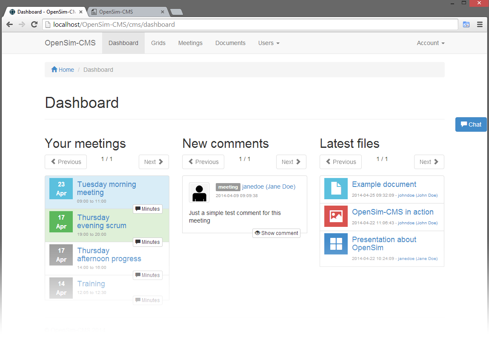

After logging in you gain access to your dashboard. The dashboard provides an overview of all your past and future meetings, comments posted after the last time you logged in and an overview of the latest documents. The previous meetings have a button `minutes` which allows you to jump to the minutes of a meeting without first having to browse to the meeting in the meeting calendar. The dashboard also allows you to jump right into a discussion by clicking on a comment, and to review the latest documents.

You can always return to your dashboard by using the `Dashboard` button at the top of the page.

## Meetings
The meetings are ordered by start date and time, and use the same color schema as used in the meetings calendar. `Green` means the meeting should be busy at this moment. This means the current date and time are within the start and end date and time of the meeting. `Blue` is used to indicate future meetings and `grey` is used for meetings that are scheduled at a date and time which has already passed.

Only minutes from meetings that are scheduled now or in the past have a button `Minutes`. Because future meetings should not have any minutes yet.

## Comments
Comments contain all visible comments to your account posted after the last time you logged in. This includes comments posted during the current session.

## Documents
The list with documents is ordered by date, with the latest first. The list only contains documents to which you have access.